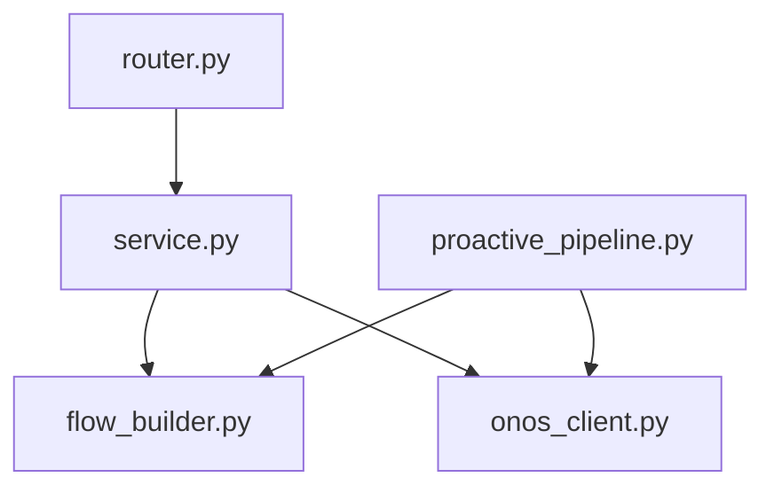

# Módulo 6 (M6) - Traductor a ONOS

Este módulo es el único encargado de comunicarse con el controlador SDN externo (ONOS). Su objetivo es recibir decisiones de alto nivel (políticas) y traducirlas a reglas técnicas OpenFlow (formato JSON) requeridas por la API REST de ONOS.

## Estructura de Archivos y Relaciones

El flujo de información y la relación entre los archivos es la siguiente:

### 1. `proactive_pipeline.py` (Inicializador)
- **Función:** Script de ejecución única al inicio del sistema.
- **Relación:** Utiliza `flow_builder.py` para generar las reglas estáticas (como redirección a Portal Cautivo y paso libre a DHCP/DNS) e interactúa directamente con ONOS mediante `requests` para establecer la red base antes de que haya tráfico dinámico.

### 2. `router.py` (API del Módulo)
- **Función:** Expone los endpoints REST de este módulo en la aplicación FastAPI (`/flows/macro`, `/flows/block`, `/flows/temporal`).
- **Relación:** Recibe peticiones HTTP semánticas desde otros módulos (ej. M2 o M4) y pasa los datos limpios hacia `service.py`.

### 3. `service.py` (Orquestador)
- **Función:** Contiene la lógica de negocio del controlador.
- **Relación:** Actúa como puente. Cuando recibe una orden de `router.py`, llama a `flow_builder.py` para traducir la regla a OpenFlow, y luego se la entrega a `onos_client.py` para que la transmita.

### 4. `flow_builder.py` (Traductor JSON)
- **Función:** Genera los diccionarios JSON estrictos según el estándar OpenFlow que exige la REST API de ONOS.
- **Relación:** Es llamado por `service.py` y `proactive_pipeline.py`. No se comunica con la red, solo construye estructuras de datos. Configura Tablas (T0, T1, T2, T3) y prioridades.

### 5. `onos_client.py` (Cliente HTTP)
- **Función:** Se comunica con el mundo exterior.
- **Relación:** Usa la librería `requests` para hacer `POST` y `DELETE` hacia la IP del servidor ONOS. Es llamado por `service.py`. Maneja tiempos de espera (timeouts) y autenticación.

## Compatibilidad e Integración
Este módulo está diseñado para ser totalmente agnóstico de la lógica de negocio de los usuarios. 
- **Con M1 (Autenticación):** No hay comunicación directa requerida, ya que M1 interactúa con DHCP y Base de Datos.
- **Con M2 (Políticas):** M2 evalúa permisos y ahora puede comunicarse de forma limpia con M6 enviando un POST local a las rutas definidas en `router.py`, sin necesidad de que M2 sepa de OpenFlow u ONOS.
