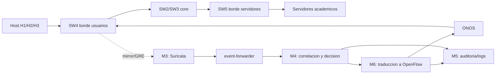
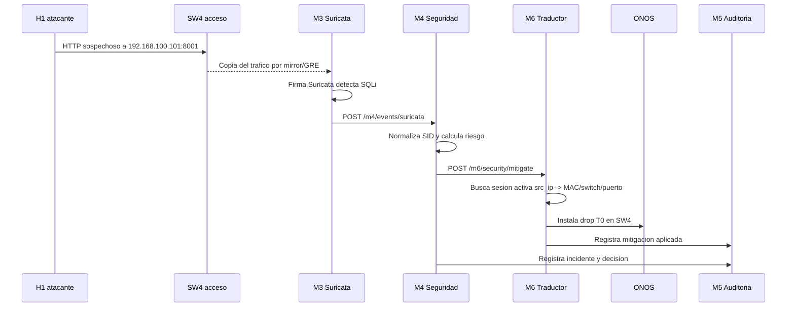
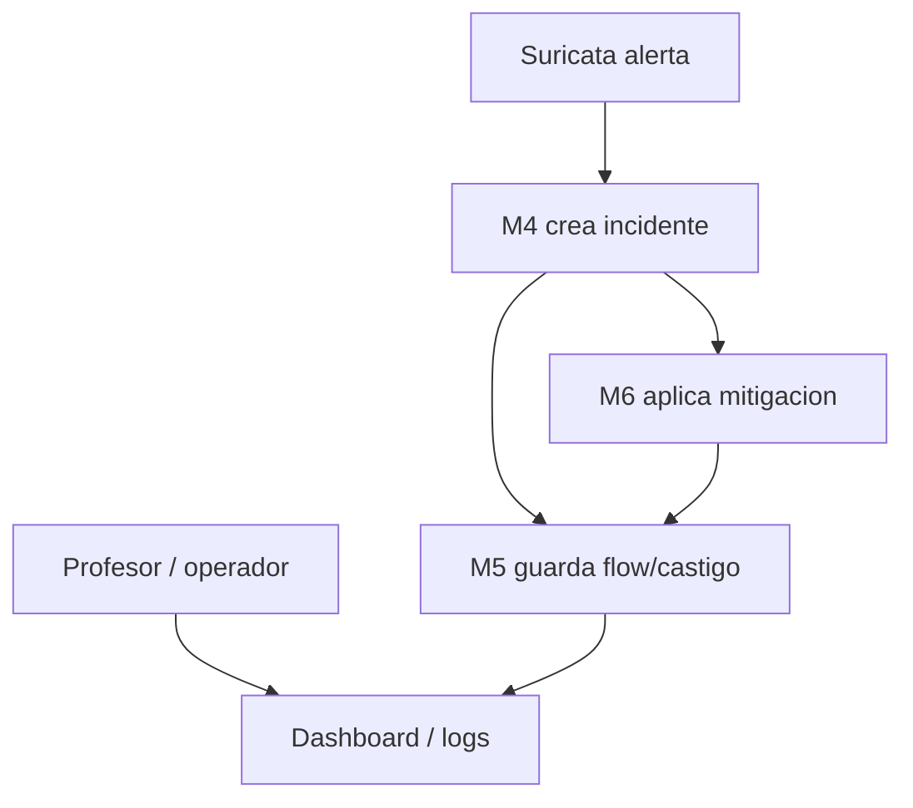
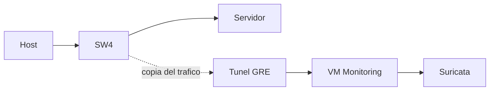

# Arquitectura De Seguridad: Suricata, M4, M6, Auditoria Y DPDK

Este documento explica de forma simple como se conectan los modulos de seguridad de la red SDN:

```text
M3 / Suricata  ->  M4 Seguridad  ->  M6 Traductor SDN  ->  ONOS/OVS
                                      |
                                      v
                                  M5 Auditoria
```

La idea principal es separar responsabilidades:

- **Suricata/M3 observa trafico y detecta alertas.**
- **M4 interpreta esas alertas y decide si ameritan mitigacion.**
- **M6 traduce la decision a reglas OpenFlow en el switch correcto.**
- **M5 registra eventos, logs y evidencia para auditoria.**
- **DPDK/GRE ayudan a que Suricata reciba trafico espejado de la red.**

## 1. Vista General



Cuando un usuario genera trafico sospechoso, Suricata lo ve por el mirror. Suricata no castiga directamente. Solo genera una alerta. M4 decide que hacer y M6 aplica la accion en la red.

## 2. Por Que No Castiga Suricata Directamente

Suricata es un sensor. Ve paquetes y aplica firmas, pero no conoce todo el contexto SDN:

- que usuario esta logueado;
- que MAC/IP/puerto fisico corresponde al host;
- en que switch de acceso esta conectado;
- si existe una sesion activa;
- que tabla OpenFlow debe recibir el castigo;
- que reglas hay que borrar luego.

Por eso Suricata solo detecta. M6 es el unico modulo que debe tocar ONOS/OVS.

## 3. Responsabilidad De Cada Modulo

| Modulo | Que hace | Que no debe hacer |
|---|---|---|
| M3 / Suricata | Inspecciona trafico y genera alertas. | No instala flows. |
| event-forwarder | Lee eventos de Suricata y los envia a M4. | No decide castigos. |
| M4 | Normaliza alertas, agrupa incidentes y decide accion. | No toca ONOS directamente. |
| M6 | Resuelve sesion/IP/MAC/switch/puerto y aplica mitigacion. | No detecta firmas de trafico profundo. |
| ONOS | Instala reglas OpenFlow en switches. | No decide politica de seguridad de alto nivel. |
| M5 | Guarda logs, eventos, auditoria y evidencia. | No cambia la red. |

## 4. Flujo De Una Alerta Real

Ejemplo: H1 intenta SQL injection contra `192.168.100.101:8001`.



## 5. Que Recibe M4 Desde Suricata

M4 recibe eventos tipo Suricata EVE. Lo importante es:

```json
{
  "event_type": "alert",
  "src_ip": "192.168.100.55",
  "dest_ip": "192.168.100.101",
  "dest_port": 8001,
  "proto": "TCP",
  "alert": {
    "signature_id": 9000002,
    "signature": "SDN DEMO possible SQL injection",
    "severity": 2
  }
}
```

M4 convierte eso en una decision:

```text
sid 9000002
tipo web_attack
severidad media/alta
accion sugerida: bloquear TCP hacia 192.168.100.101:8001
```

## 6. Que Le Manda M4 A M6

M4 no le manda una flow OpenFlow a M6. Le manda una alerta normalizada:

```json
{
  "incident_id": "m4-incident-abc",
  "source": "suricata",
  "sid": 9000002,
  "src_ip": "192.168.100.55",
  "dst_ip": "192.168.100.101",
  "dst_port": 8001,
  "proto": "TCP",
  "signature": "SDN DEMO possible SQL injection"
}
```

M6 se encarga de resolver:

```text
192.168.100.55 -> usuario activo
192.168.100.55 -> MAC del host
MAC/IP -> switch de acceso
switch de acceso -> puerto fisico
SID -> tipo de castigo
```

Esto evita que M4 tenga que conocer detalles de OpenFlow.

## 7. Que Instala M6

M6 instala mitigaciones en **T0 del switch de acceso** porque son reglas de seguridad de alta prioridad.

Ejemplo para SQLi/path traversal:

```text
SW4 T0:
priority=39000,tcp,
in_port=ens4,
dl_src=MAC_H1,
nw_src=192.168.100.55,
nw_dst=192.168.100.101,
tp_dst=8001
actions=drop
```

Por que T0:

- corta el trafico antes de T1/T2/T3;
- evita que el atacante siga usando flows normales;
- no depende de la politica academica;
- es temporal y se puede retirar.

## 8. Tipos De Mitigacion

| Caso | Ejemplo | Mitigacion |
|---|---|---|
| SQL injection | `9000002` | Drop TCP hacia IP:puerto del recurso. |
| Path traversal | `9000014` | Drop TCP hacia IP:puerto del recurso. |
| Port scan | `9000001`, `9000008`, `9000009`, `9000010` | Drop TCP hacia el destino escaneado. |
| ICMP grande | `9000018` | Drop ICMP del host atacante. |
| SSH/RDP/FTP burst | `9000027`, `9000028`, `9000029` | Drop TCP hacia ese puerto. |
| Estres de puerto | Evento M5/M4 de performance | Meter/rate-limit temporal en T0. |

## 9. Unmitigate

Si fue una prueba o falso positivo, se puede retirar el castigo:

```text
POST /m6/security/unmitigate
```

Payload:

```json
{
  "incident_id": "m4-incident-abc"
}
```

M6 elimina las flows asociadas a ese incidente y marca la mitigacion como expirada. Si vuelve a ocurrir el ataque, M4 puede reabrir el incidente y pedir otra mitigacion.

## 10. Rate Limit / Meter

No todos los problemas deben terminar en `drop`. Si un host genera mucho trafico pero no se quiere cortarlo completamente, se usa un **meter**.

Ejemplo conceptual:

```text
M5 detecta mucho trafico en SW4 puerto ens4
M5/M4 avisa a M6
M6 instala meter temporal de 50 pps
```

Flow esperada:

```text
SW4 T0:
priority=38900,
in_port=ens4,
nw_src=192.168.100.55
actions=meter:ID,goto_table:1
```

Esto limita el ruido pero permite que el trafico siga pasando por el pipeline normal.

## 11. Donde Entra M5 / Auditoria

M5 sirve para guardar evidencia. No decide castigos ni toca ONOS.

Eventos que conviene auditar:

- alerta recibida por M4;
- incidente creado;
- decision tomada por M4;
- payload enviado a M6;
- respuesta de M6;
- flow instalada;
- flow retirada;
- error al mitigar;
- unmitigate manual;
- rate-limit aplicado;
- expiracion de mitigacion.



La auditoria permite responder:

```text
quien ataco,
desde que IP/MAC,
contra que recurso,
que regla Suricata se activo,
que castigo aplico M6,
cuando empezo,
cuando termino,
quien lo retiro si fue manual.
```

## 12. Como Funciona DPDK En Esta Arquitectura

DPDK permite que Suricata procese paquetes con mejor rendimiento, evitando parte del camino normal del kernel Linux.

En esta red, DPDK se usa en la VM de monitoreo para que Suricata lea trafico de una interfaz dedicada.

Idea simple:

```text
OVS mirror/GRE copia trafico
        |
        v
VM monitoring
        |
        v
interfaz dedicada a DPDK
        |
        v
Suricata inspecciona paquetes
```

## 13. DPDK No Es Una Mitigacion

DPDK no bloquea trafico. DPDK solo ayuda a capturarlo/procesarlo mas rapido.

| Elemento | Funcion |
|---|---|
| GRE/mirror | Copia trafico hacia monitoring. |
| DPDK | Entrega paquetes a Suricata con menor overhead. |
| Suricata | Detecta firmas. |
| M4 | Decide respuesta. |
| M6 | Aplica castigo. |

## 14. GRE / Mirror

El mirror copia trafico desde switches hacia M3/Suricata.



Importante:

- El trafico original sigue su camino normal.
- La copia va a Suricata para inspeccion.
- Suricata puede alertar aunque el servidor responda normal.
- Si GRE falla, la red puede seguir funcionando, pero se pierde visibilidad.

## 15. Que Pasa Si Suricata Esta En 100% CPU

Puede ser normal ver Suricata cerca de 100% si corre con DPDK, porque puede quedar en polling constante esperando paquetes.

No necesariamente significa que la VM se esta quemando.

Hay que revisar:

```text
drops de Suricata,
uso sostenido de memoria,
perdida de paquetes,
cola del forwarder,
latencia de M4/M6,
cantidad de trafico espejado.
```

Si CPU esta alto pero no hay drops y la VM responde, puede estar bien. Si hay drops o la VM se vuelve lenta, hay que reducir el trafico espejado o ajustar DPDK/Suricata.

## 16. Seguridad De La Separacion

La separacion evita errores peligrosos:

- Suricata no puede instalar flows equivocadas.
- M4 no necesita conocer puertos fisicos.
- M6 valida que haya sesion activa antes de castigar.
- M6 combina `in_port + MAC + IP` cuando puede.
- M5 guarda evidencia para revisar despues.

## 17. Resumen En Una Frase

```text
Suricata ve, M4 decide, M6 castiga, ONOS aplica, M5 audita y DPDK ayuda a observar sin cargar el camino normal.
```

